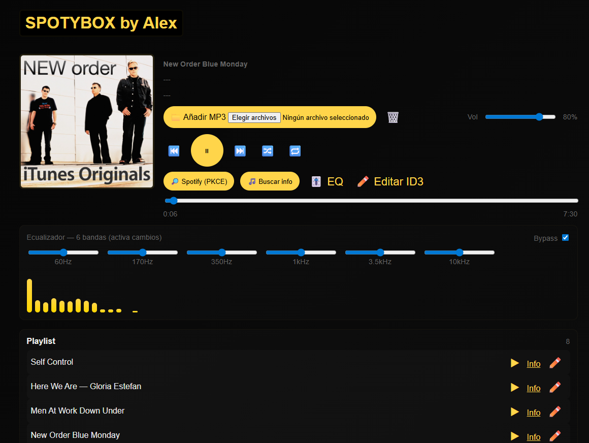
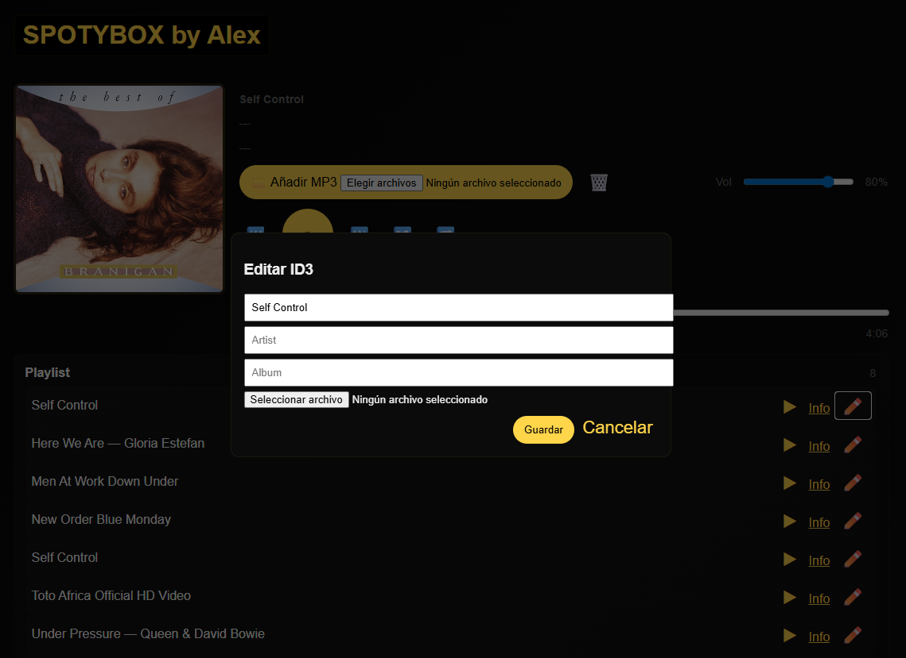

# SPOTYBOX
 


# Jukebox Web Player 🎵

**Jukebox** es un reproductor de audio web avanzado que permite reproducir archivos MP3 locales, mostrar un visualizador de frecuencia en tiempo real, ajustar un ecualizador gráfico, editar etiquetas ID3 y buscar información de canciones en Spotify, iTunes, MusicBrainz y Google.

---

## Características

- Reproducción de archivos MP3 locales.
- Playlist dinámica con título, artista y álbum.
- Visualizador de barras de frecuencia en tiempo real.
- Ecualizador gráfico de 6 bandas (60Hz – 10kHz) con opción de bypass.
- Editor de etiquetas ID3 (TÍTULO, ARTISTA, ÁLBUM, CARÁTULA).
- Autocompletado de carátulas usando iTunes y MusicBrainz.
- Integración básica con Spotify (PKCE) para abrir la canción.
- Botón de info estilo Shazam → busca en Google como fallback.
- Control de volumen y progreso de reproducción.
- Guardado de carátulas en cache local (`localStorage`).

---

## Capturas




---

## Instalación

1. Clona el repositorio:

```bash
git clone https://github.com/tuusuario/jukebox-web.git
cd jukebox-web

